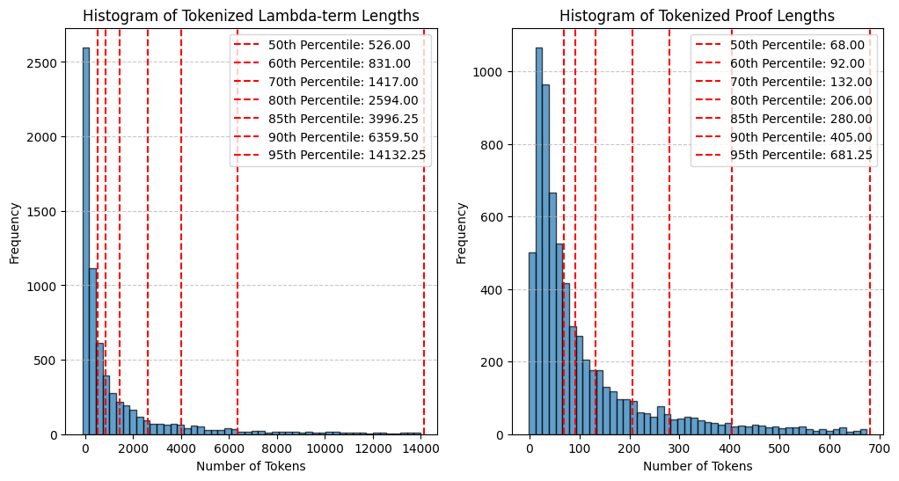

## Introduction

Even though sequence of tactics can vary significantly between languages, our hope is that we can translate lambda-terms from one language (e.g., a proof from Mathlib in Lean) into a sequence of tactics in another language (e.g., in Rocq). In this sense, we use **$\lambda$-calculus** as a pivot language.

This approach avoid the issue of **parallel data scarcity** in translation tasks between proof assistants.
Moreover, Lean and Rocq rely on the same type of $\lambda$-calculus (namely Calculus of Inductive Constructions), making them natural candidates for this specific experimentation.

### Related works

Translation from lambda term to proof tactics is not an extensively studied problem in the literature.
Nonetheless, some closely related problems have been explored.
We cite a few of them:

* [[1](#1)] uses **DNNs** to generate lambda terms (for a simply typed $\lambda$-calculus with pairs and sums) associated with a given type. In this case, the dataset can be entirely generated synthetically.
* [[2](#2)] uses **Transformer** for type inference in a simply typed $\lambda$-calculus.
* [[3](#3)] uses an **LLM** to translate assembler to C source code. While not strictly equivalent to our topic of interest, the success of this approach provides positive insights for our problem.
* [[4](#4)] (Sec. 4, figure 1) proposes intermediate tasks to mitigate the issue of scarce data in formalized libraries. Some of these tasks involve the manipulation of lambda-terms, namely:
    * **Proof term prediction**: Given a tactic state, predict the entire proof term.
    * **Skip-proof**: Given a partial proof term (with a masked subterm), predict the masked subterm.
    * **Type prediction**: Given a partial proof term, predict the type of the masked subterm.
    * **Proof term elaboration**: Given a proof term (pretty-printed), predict its fully elaborated version.

### Datasets

In terms of datasets our two main sources are
* **CoqStoq** from [[5](#5)], which includes 2,226 github repo/196,929 (deduplicated) theorems/2,225,515 steps that compiles using Coq 8.18.
* **LeanDojo benchmark** from [[6](#6)], which includes 98,734 theorems and proofs.

One of our goal is to experiment with **cross-translation** (e.g., given a $\lambda$ term in Lean, produce a sequence of tactics in Rocq).
To evaluate this setup, we will use **miniF2F** [[7](#7)], and one of its translations to Rocq [[29](#29)].

We also introduce two new datasets
* **Pile of Rocq**: a collection of Rocq codes and documentation to pre-trained LLMs.
* **Rocq reasoning**: a subset of mathcomp and mathcomp analysis augmented with CoT synthetically generated with DeepSeek R1.

### Available pre trained models

* Models pre trained on a **math corpus** seem to gain some advantages over generic ones [[4](#4)].
* **Deepseek Prover** [[9](#9), [10](#10)] and **DeepSeek Coder** [[11](#11)] are strong candidates for our needs.
* Even more recently, **DeepSeek R1** seems to be the way to go if **test-time compute** is to be explored.

### Data Extraction

In addition to the datasets already considered, we need to extract lambda-terms associated with proofs.
We leverage **CoqPyt** [[12](#12)] to do so.

One issue caused by the manipulation of lambda-terms is their potential length, which may exceed the capacity of transformer-based models (see [Fig. 1](#tokens_len)).

<center id="tokens_len">

||
|:--:|
|**Fig. 1.** Histogram of lambda term lengths and Proof lengths|
</center>


## Full training

In this first scenario, we train a transformer from scratch.

**Will probably not be implemented, [see here](scratch.md) for more details**.

## Fine-tuning of LLM

In this second scenario, we finetune an already trained LLM.
We use a backward approach to distill reasoning abilities of **DeepSeek R1**.

The idea is to create reasoning trace from known solution (proof), to augment the dataset size and improve the imbalance between lambda term and sequences of tactics during training.

Backward approach is motivated by the very poor performance of the best model on the task of translation from $\lambda$-calculus to sequence of tactics (see [Fig.4.](#baseline), **WIP**). *On a subset of the test set (50 elements), only DeepSeek R1 is able to translate one correct lambda term (hence 2% success rate) to a sequence of tactics. Unfortunately this is the exact proof original proof, which may be an indication of a pure memorized answer*.

To improve the quality of the final reasoning, we propose a method of filtration based on the ability of a smaller model to predict the right sequence of tokens given an obfuscated version of the reasoning.

We describe the generation pipeline in the above [figure](#pipeline).

<center id="pipeline">

||
|:--:|
|**Fig. 3.** Pipeline for data augmentation|
</center>

<center id="baseline">

||
|:--:|
|**Fig. 4.** Baseline results: Translation from $\lambda$-calculus to sequence of tactics on a diverse set of extracted lemmas from Mathcomp.|
</center>

### Multi steps approach

#### First step

Using Coqpyt [[12](#12)], we extract all terms, premises, notations, and proofs.

#### First step bis

Using Pytanque[[28](#28)], we check that previously parsed information is accurate by recompiling them step by step.
In doing so, we also retrieve goals and subgoals.

#### Second and third steps

We tokenize lambda terms, and filter the dataset based on a maximum threshold (e.g. $\leq 3750$ tokens), see [Fig. 1.](#tokens_len).

#### Fourth step

We select a subset of **diverse** terms by maximizing the distance (BM25 implementation) of documents (in our case, statement + proofs).

#### Fifth step

For each term, we generate multiple reasonings (sampling multiple reasonings) by leveraging the DeepSeek R1 model in a backward manner. More precisely, given a lambda term and a target sequence of tactics, we ask the model to generate a reasoning simulating a process that leads to this sequence of tactics (see [prompt](#prompt-to-generate-reasoning)).

#### Sixth step

For each reasoning, we compute a score based on its ability to help our target model to deduce the correct sequence of tactics. To do so, we:

* Generate obfuscated reasoning, obtained by masking all premises and keywords in the reasoning (see [example](#example-obfuscated-reasoning))
* Append the lambda term, the hidden reasoning, and the sequence of tactics (see [prompt](#prompt-to-score-reasoning)) to compute the logprobs associated with the sequence of tactics.
* Then we compute four scores scores:
   * **Mean score**: mean probability associated with all tokens in the sequence of tactics.
   * **Decision score**: mean probability associated only with tokens that are prefixex of words.
   * **Completion score**: mean probabiltiy associated only with tokens that are not prefixes of words.
   * **Normalized mean score**: sum of normalized decision score and normalized completion score.

See [Fig. 5.a](#scores-explained) for an illustration of these different scoring strategies.

Since completion and decision are not always comparable (e.g., when premises are available in the context, completion can be way easier) a relatively small fluctuation of one score could completely overshadow an improvement in the other score (see [Fig. 5.b](#scores), where we consider two two baselines: *no reasoning*, where no reasoning is provided, and *mixed*, where an unrelated obfuscated reasoning is provided)).

<a id="scores-explained"></a>

||
|:--:|
|**Fig. 5.a** Illustration of scores|

<a id="scores"></a>

|| 
|:--:|
|**Fig. 5.b** Scores example| 


#### Seventh step

In this last step, we ask a final model to check whether best reasonings do not rely on already knowing the sequence of tactics, and truly simulate a discovery process (see [prompt](#prompt-to-check-final-reasoning)).
If not, then check the next best reasoning, up until it find one that meet previous criteria.


## Pre training

In this section, we explore ideas for pre-training to mitigate issues caused by data scarcity.
As observed in prior work[[13](#13)], starting from a model already specialized on **informal mathematics** seems to be beneficial for the final model; this approach was also taken in [[9](#9), [10](#10)].

Following [[1](#1)] we could also consider an initial training step focusing on a simpler $\lambda$-calculus, allowing us to algorithmically construct well-typed terms and then train the model to infer types.

*Pile of Rocq, pre-training, etc. WIP*

## Inference

### Test-time Compute

Inspired by recent works, we experiment with some **test-time compute** techniques.

First we experiment around some post-training technics based on **RL**[[21](#21)] trained models.
Recently, models such as **O1** [[22](#22)], and **DeepSeek R1**[[21](#21)] have significativly improve performance in various reasoning tasks by increasing the length of the **chain-of-thought** process.

In the case of **DeepSeek R1**, the idea is to train a model to develop reasoning capabilities through an almost pure RL process, by allowing it to explore chain-of-thought space.

Different methods are considered for test-time compute: for example **best-first search** [[4](#4)], **Monte Carlo Tree Search (MCTS)** [[25](#25), [26](#26)], and **Process Reward Model (PRM)** approaches [[23](#23), [24](#24)].
However, as pointed out in [[21](#21)], these methods are difficult to leverage.
Additionnaly, since we have the ability to check the validity of each solutions, we do not have to filter the final pool of candidate answers.

In the second scenario (LLM finetuning), we explore the **budget forcing** approach describes in [[27](#27)].
The idea is to augment the size of the CoT by **forcing** the LLM to continue its reasoning by rejecting the end-of-thinking token and appending new tokens to enforce a continuation (e.g., "Wait"), see [Fig 6.](#pipeline) extracted from [[27](#27)].

<center id="pipeline">

||
|:--:|
|**Fig. 6.** Budget forcing, *figure 3, from [[27](#27)]*|
</center>


### Translation

*WIP*

For the translation task, we use the **$\lambda$-calculus** as a pivot language.

Even though this situation was not encountered in the dataset, we hope the model can solve it.


## Results

*WIP*

## Bibliography

[<a id="1">1</a>]
Taro Sekiyama,
Akifumi Imanishi,
Kohei Suenaga:
Towards Proof Synthesis  Guided by Neural Machine Translation  for Intuitionistic Propositional Logic.

[<a id="2">2</a>]
Brando Miranda,
Nathan Fulton,
Avi Shinnar,
Vasily Pestun,
Barry Trager:
Transformer Models for Type Inference in the  Simply Typed Lambda Calculus: A Case Study  in Deep Learning for Code

[<a id="3">3</a>]
Hanzhuo Tan,
Qi Luo,
Jing Li,
Yuqun Zhang:
LLM4Decompile: Decompiling Binary Code with Large Language Models

[<a id="4">4</a>]
Jesse Michael Han,
Jason Rute,
Edward W. Ayers,
Stanislas Polu:
Proof Artifact Co-training for Theorem Proving with Language Models

[<a id="5">5</a>]
Kyle Thompson,
Nuno Saavedra,
Pedro Carrott,
Kevin Fisher,
Alex Sanchez-Stern,
Yuriy Brun,
Joao F. Ferreira
Sorin Lerner
Emily First:
Rango: Adaptive Retrieval-Augmented Proving for  Automated Software Verification

[<a id="6">6</a>]
Kaiyu Yang,
Aidan M. Swope,
Alex Gu,
Rahul Chalamala,
Peiyang Song,
Shixing Yu,
Saad Godil,
Ryan Prenger,
Anima Anandkumar:
LeanDojo: Theorem Proving with Retrieval-Augmented Language Models

[<a id="7">7</a>]
Kunhao Zheng,
Jesse Michael Han,
Stanislas Polu:
miniF2F: A Cross-system Benchmark for Formal Olympiad-level Mathematics

[<a id="9">9</a>]
Huajian Xin,
Z.Z. Ren,
Junxiao Song,
Zhihong Shao,
Wanjia Zhao,
Haocheng Wang,
Bo Liu,
Liyue Zhang Xuan Lu,
Qiushi Du,
Wenjun Gao,
Qihao Zhu,
Dejian Yang,
Zhibin Gou,
Z.F. Wu,
Fuli Luo,
Chong Ruan:
DeepSeek-Prover-V1.5: Harnessing Proof Assistant Feedback for Reinforcement Learning and Monte-Carlo Tree Search

[<a id="10">10</a>]
Huajian Xin,
Daya Guo,
Zhihong Shao,
Z.Z. Ren,
Qihao Zhu,
Bo Liu,
Chong Ruan,
Wenda Li,
Xiaodan Liang:
DeepSeek-Prover: Advancing Theorem Proving in LLMs through Large-Scale Synthetic Data

[<a id="11">11</a>]
Daya Guo,
Qihao Zhu,
Dejian Yang,
Zhenda Xie,
Kai Dong,
Wentao Zhang,
Guanting Chen,
Xiao Bi,
Y. Wu,
Y.K. Li,
Fuli Luo,
Yingfei Xiong,
Wenfeng Liang:
DeepSeek-Coder: When the Large Language Model Meets Programming -- The Rise of Code Intelligence

[<a id="12">12</a>]
Pedro Carrott,
Nuno Saavedra,
Kyle Thompson,
Sorin Lerner,
João F. Ferreira,
Emily First:
CoqPyt: Proof Navigation in Python in the Era of LLMs

[<a id="13">13</a>]
Ashish Vaswani,
Noam Shazeer,
Niki Parmar,
Jakob Uszkoreit,
Llion Jones,
Aidan N. Gomez,
Lukasz Kaiser,
Illia Polosukhin:
Attention Is All You Need

[<a id="15">15</a>]
Andrew Jaegle,
Sebastian Borgeaud,
Jean-Baptiste Alayrac,
Carl Doersch,
Catalin Ionescu,
David Ding,
Skanda Koppula,
Daniel Zoran,
Andrew Brock,
Evan Shelhamer,
Olivier Hénaff,
Matthew M. Botvinick,
Andrew Zisserman,
Oriol Vinyals,
Joāo Carreira:
Perceiver IO: A General Architecture for Structured Inputs & Outputs


[<a id="16">16</a>]
Hugo Laurençon,
Léo Tronchon,
Matthieu Cord,
Victor Sanh:
What matters when building vision-language models? 

[<a id="17">17</a>]
Xiaoyi Dong,
Pan Zhang,
Yuhang Zang,
Yuhang Cao,
Bin Wang,
Linke Ouyang,
Xilin Wei,
Songyang Zhang,
Haodong Duan,
Maosong Cao,
Wenwei Zhang,
Yining Li,
Hang Yan,
Yang Gao,
Xinyue Zhang,
Wei Li,
Jingwen Li,
Kai Chen,
Conghui He,
Xingcheng Zhang,
Yu Qiao,
Dahua Lin,
Jiaqi Wang: Internlm-xcomposer2: Mastering free-form text-image composition and comprehension in vision-language large model. 

[<a id="18">18</a>]
Shakti N. Wadekar,
Abhishek Chaurasia,
Aman Chadha,
Eugenio Culurciello: The Evolution of Multimodal Model Architectures.

[<a id="19">19</a>]
S. Polu,
I. Sutskever:
Generative language modeling for automated theorem proving. 

[<a id="NC_1">20</a>]
Andrew Jaegle,
Felix Gimeno,
Andrew Brock,
Andrew Zisserman,
Oriol Vinyals,
Joao Carreira:
Perceiver: General Perception with Iterative Attention

[<a id="21">21</a>]
DeepSeek-AI, Daya Guo, Dejian Yang, Haowei Zhang, Junxiao Song, Ruoyu Zhang, Runxin Xu, Qihao Zhu, Shirong Ma, Peiyi Wang, Xiao Bi, Xiaokang Zhang, Xingkai Yu, Yu Wu, Z.F. Wu, Zhibin Gou, Zhihong Shao, Zhuoshu Li, Ziyi Gao, Aixin Liu, Bing Xue, Bingxuan Wang, Bochao Wu, Bei Feng, Chengda Lu, Chenggang Zhao, Chengqi Deng, Chenyu Zhang, Chong Ruan, Damai Dai, Deli Chen, Dongjie Ji, Erhang Li, Fangyun Lin, Fucong Dai, Fuli Luo, Guangbo Hao, Guanting Chen, Guowei Li, H. Zhang, Han Bao, Hanwei Xu, Haocheng Wang, Honghui Ding, Huajian Xin, Huazuo Gao, Hui Qu, Hui Li, Jianzhong Guo, Jiashi Li, Jiawei Wang, Jingchang Chen, Jingyang Yuan, Junjie Qiu, Junlong Li, J.L. Cai, Jiaqi Ni, Jian Liang, Jin Chen, Kai Dong, Kai Hu, Kaige Gao, Kang Guan, Kexin Huang, Kuai Yu, Lean Wang, Lecong Zhang, Liang Zhao, Litong Wang, Liyue Zhang, Lei Xu, Leyi Xia, Mingchuan Zhang, Minghua Zhang, Minghui Tang, Meng Li, Miaojun Wang, Mingming Li, Ning Tian, Panpan Huang, Peng Zhang, Qiancheng Wang, Qinyu Chen, Qiushi Du, Ruiqi Ge, Ruisong Zhang, Ruizhe Pan, Runji Wang, R.J. Chen, R.L. Jin, Ruyi Chen, Shanghao Lu, Shangyan Zhou, Shanhuang Chen, Shengfeng Ye, Shiyu Wang, Shuiping Yu, Shunfeng Zhou, Shuting Pan, S.S. Li et al:
DeepSeek-R1: Incentivizing Reasoning Capability in LLMs via Reinforcement Learning

[<a id="22">22</a>]
OpenAI: Aaron Jaech, Adam Kalai, Adam Lerer, Adam Richardson, Ahmed El-Kishky, Aiden Low, Alec Helyar, Aleksander Madry, Alex Beutel, Alex Carney, Alex Iftimie, Alex Karpenko, Alex Tachard Passos, Alexander Neitz, Alexander Prokofiev, Alexander Wei, Allison Tam, Ally Bennett, Ananya Kumar, Andre Saraiva, Andrea Vallone, Andrew Duberstein, Andrew Kondrich, Andrey Mishchenko, Andy Applebaum, Angela Jiang, Ashvin Nair, Barret Zoph, Behrooz Ghorbani, Ben Rossen, Benjamin Sokolowsky, Boaz Barak, Bob McGrew, Borys Minaiev, Botao Hao, Bowen Baker, Brandon Houghton, Brandon McKinzie, Brydon Eastman, Camillo Lugaresi, Cary Bassin, Cary Hudson, Chak Ming Li, Charles de Bourcy, Chelsea Voss, Chen Shen, Chong Zhang, Chris Koch, Chris Orsinger, Christopher Hesse, Claudia Fischer, Clive Chan, Dan Roberts, Daniel Kappler, Daniel Levy, Daniel Selsam, David Dohan, David Farhi, David Mely, David Robinson, Dimitris Tsipras, Doug Li, Dragos Oprica, Eben Freeman, Eddie Zhang, Edmund Wong, Elizabeth Proehl, Enoch Cheung, Eric Mitchell, Eric Wallace, Erik Ritter, Evan Mays, Fan Wang, Felipe Petroski Such, Filippo Raso, Florencia Leoni, Foivos Tsimpourlas, Francis Song, Fred von Lohmann, Freddie Sulit, Geoff Salmon, Giambattista Parascandolo, Gildas Chabot, Grace Zhao, Greg Brockman, Guillaume Leclerc, Hadi Salman, Haiming Bao, Hao Sheng, Hart Andrin, Hessam Bagherinezhad, Hongyu Ren, Hunter Lightman, Hyung Won Chung, Ian Kivlichan, Ian O'Connell, Ian Osband, Ignasi Clavera Gilaberte, Ilge Akkaya et al.:
OpenAI o1 System Card

[<a id="23">23</a>]
H. Lightman, V. Kosaraju, Y. Burda, H. Edwards, B. Baker, T. Lee, J. Leike, J. Schulman, I. Sutskever, and K. Cobbe:
Let’s verify step by step. 

[<a id="24">24</a>]
Zhenru Zhang, Chujie Zheng, Yangzhen Wu, Beichen Zhang, Runji Lin, Bowen Yu, Dayiheng Liu, Jingren Zhou, Junyang Lin:
The Lessons of Developing Process Reward Models in Mathematical Reasoning

[<a id="25">25</a>]
Peiyi Wang, Lei Li, Zhihong Shao, Runxin Xu, Damai Dai, Yifei Li, Deli Chen, Yu Wu, and Zhifang Sui.
Math-shepherd: Verify and reinforce LLMs step-by-step without human annotations

[<a id="26">26</a>]
Liangchen Luo, Yinxiao Liu, Rosanne Liu, Samrat Phatale, Meiqi Guo, Harsh Lara, Yunxuan Li, Lei Shu,
Yun Zhu, Lei Meng, Jiao Sun, and Abhinav Rastogi: Improve mathematical reasoning in language
models by automated process supervision

[<a id="27">27</a>]
Niklas Muennighoff, Zitong Yang, Weijia Shi, Xiang Lisa Li, Li Fei-Fei, Hannaneh Hajishirzi, Luke Zettlemoyer, Percy Liang, Emmanuel Candès, Tatsunori Hashimoto: s1: Simple test-time scaling

[<a id="28">28</a>]
Laetitia Teodorescu,
Guillaume Baudart,
Emilio Jesús Gallego Arias,
Marc Lelarge,
NLIR: Natural Language Intermediate Representation for Mechanized Theorem Proving

[<a id="29">29</a>]
Jules Viennot,
Guillaume Baudart,
Emilio Jesús Gallego Arias,
Marc Lelarge:
MiniF2F in Rocq: Automatic Translation Between Proof Assistants — A Case Study


## Appendix

#### Lambda term

```
abelian_type_mx_group =
fun m n q =>
(fun
   _evar_0_ : 1 < q ->
              nseq
                'r([set: matrix_matrix__canonical__fingroup_FinGroup
                           (fintype_ordinal__canonical__FinRing_Zmodule
                              (Zp_trunc q).+1) m n]%G)
                (exponent
                   [set: matrix_matrix__canonical__fingroup_FinGroup
                           (fintype_ordinal__canonical__FinRing_Zmodule
                              (Zp_trunc q).+1) m n]%G) = 
              nseq (m * n) q =>
 eq_ind_r
   (fun _pattern_value_ : seq nat =>
    1 < q -> _pattern_value_ = nseq (m * n) q) _evar_0_
   (abelian_type_homocyclic (mx_group_homocyclic m n q)))
  ((fun
      _evar_0_ : 1 < q ->
                 nseq (m * n)
                   (exponent
                      [set: matrix_matrix__canonical__fingroup_FinGroup
                              (fintype_ordinal__canonical__FinRing_Zmodule
                                 (Zp_trunc q).+1) m n]%G) = 
                 nseq (m * n) q =>
    eq_ind_r
      (fun _pattern_value_ : nat =>
       1 < q ->
       nseq _pattern_value_
         (exponent
            [set: matrix_matrix__canonical__fingroup_FinGroup
                    (fintype_ordinal__canonical__FinRing_Zmodule
                       (Zp_trunc q).+1) m n]%G) = 
       nseq (m * n) q) _evar_0_ (rank_mx_group m n q))
     (ssr_have_upoly
        (posnP (m * n) : eqn0_xor_gt0 (m * n) ((m * n)%N == 0%N) (0 < m * n))
        (fun
           __top_assumption_ : eqn0_xor_gt0 (m * n) 
                                 ((m * n)%N == 0%N) 
                                 (0 < m * n) =>
         (fun
            (_evar_0_ : forall e : (m * n)%N = 0%N,
                        (fun b b0 : bool =>
                         fun=> 1 < q ->
                               nseq (m * n)
                                 (exponent
                                    [set: matrix_matrix__canonical__fingroup_FinGroup
                                            (fintype_ordinal__canonical__FinRing_Zmodule
                                               (Zp_trunc q).+1) m n]%G) =
                               nseq (m * n) q) true false 
                          (Eq0NotPos e))
            (_evar_0_0 : forall i : 0 < m * n,
                         (fun b b0 : bool =>
                          fun=> 1 < q ->
                                nseq (m * n)
                                  (exponent
                                     [set: matrix_matrix__canonical__fingroup_FinGroup
                                             (fintype_ordinal__canonical__FinRing_Zmodule
                                                (Zp_trunc q).+1) m n]%G) =
                                nseq (m * n) q) false true 
                           (PosNotEq0 i)) =>
          match
            __top_assumption_ as e in (eqn0_xor_gt0 _ b b0)
            return
              ((fun b1 b2 : bool =>
                fun=> 1 < q ->
                      nseq (m * n)
                        (exponent
                           [set: matrix_matrix__canonical__fingroup_FinGroup
                                   (fintype_ordinal__canonical__FinRing_Zmodule
                                      (Zp_trunc q).+1) m n]%G) =
                      nseq (m * n) q) b b0 e)
          with
          | Eq0NotPos e => _evar_0_ e
          | PosNotEq0 i => _evar_0_0 i
          end)
           (fun __top_assumption_0 : (m * n)%N = 0%N =>
            (fun
               _evar_0_ : 1 < q ->
                          nseq 0
                            (exponent
                               [set: matrix_matrix__canonical__fingroup_FinGroup
                                       (fintype_ordinal__canonical__FinRing_Zmodule
                                          (Zp_trunc q).+1) m n]%G) = 
                          nseq 0 q =>
             eq_ind_r
               (fun _pattern_value_ : nat =>
                1 < q ->
                nseq _pattern_value_
                  (exponent
                     [set: matrix_matrix__canonical__fingroup_FinGroup
                             (fintype_ordinal__canonical__FinRing_Zmodule
                                (Zp_trunc q).+1) m n]%G) =
                nseq _pattern_value_ q) _evar_0_ __top_assumption_0)
              (fun=> erefl))
           ((fun
               _evar_0_ : (0 < m) && (0 < n) ->
                          1 < q ->
                          nseq (m * n)
                            (exponent
                               [set: matrix_matrix__canonical__fingroup_FinGroup
                                       (fintype_ordinal__canonical__FinRing_Zmodule
                                          (Zp_trunc q).+1) m n]%G) =
                          nseq (m * n) q =>
             eq_ind_r
               (fun _pattern_value_ : bool =>
                _pattern_value_ ->
                1 < q ->
                nseq (m * n)
                  (exponent
                     [set: matrix_matrix__canonical__fingroup_FinGroup
                             (fintype_ordinal__canonical__FinRing_Zmodule
                                (Zp_trunc q).+1) m n]%G) = 
                nseq (m * n) q) _evar_0_ (muln_gt0 m n))
              (fun _view_subject_ : (0 < m) && (0 < n) =>
               (fun __top_assumption_0 : 0 < m /\ 0 < n =>
                (fun
                   _evar_0_ : forall (a : 0 < m) (b : 0 < n),
                              (fun=> 1 < q ->
                                     nseq (m * n)
                                       (exponent
                                          [set: matrix_matrix__canonical__fingroup_FinGroup
                                                 (fintype_ordinal__canonical__FinRing_Zmodule
                                                 (Zp_trunc q).+1) m n]%G) =
                                     nseq (m * n) q) 
                                (conj a b) =>
                 match
                   __top_assumption_0 as a
                   return
                     ((fun=> 1 < q ->
                             nseq (m * n)
                               (exponent
                                  [set: matrix_matrix__canonical__fingroup_FinGroup
                                          (fintype_ordinal__canonical__FinRing_Zmodule
                                             (Zp_trunc q).+1) m n]%G) =
                             nseq (m * n) q) a)
                 with
                 | conj a b => _evar_0_ a b
                 end)
                  (fun (m_gt0 : 0 < m) (n_gt0 : 0 < n) =>
                   [eta (fun (_evar_0_ : nseq (m * n) q = nseq (m * n) q)
                           (_evar_0_0 : 0 < m) (_evar_0_1 : 0 < n)
                           (_evar_0_2 : 1 < q) =>
                         eq_ind_r
                           (fun _pattern_value_ : nat =>
                            nseq (m * n) _pattern_value_ = nseq (m * n) q)
                           _evar_0_
                           (exponent_mx_group _evar_0_0 _evar_0_1 _evar_0_2))
                          erefl m_gt0 n_gt0])) (elimTF andP _view_subject_))))))
     : forall m n [q],
       1 < q -> abelian_type [set: 'M_(m, n)] = nseq (m * n) q

Arguments abelian_type_mx_group (m n)%nat_scope [q]%nat_scope _

```

<a id="example-reasoning"></a>
#### Example of reasoning

```
Okay, so I'm trying to figure out how this lambda term translates into a sequence of Coq tactics. Let's start by dissecting the lambda term step by step. The term starts with a function that takes m, n, and q as arguments. There's a lot of nested functions and applications here, which probably correspond to tactic applications in the proof.

First, looking at the outermost layer: the term uses eq_ind_r, which is used for rewriting based on an equality. In Coq, eq_ind_r is related to the rewrite tactic, where we replace a term with an equal one. The use of eq_ind_r here might mean we're doing some kind of equality substitution. So maybe the first step is a rewrite with a specific lemma.

Looking deeper, there's a mention of abelian_type_homocyclic applied to mx_group_homocyclic m n q. Now, abelian_type_homocyclic is a lemma that relates the abelian type of a group to it being homocyclic, and mx_group_homocyclic probably states that the matrix group in question is indeed homocyclic. So this pair suggests that we need to apply the abelian_type_homocyclic lemma to the fact that the matrix group is homocyclic. In Coq, applying a lemma like this would correspond to a rewrite or a direct application. Since it's part of an equality substitution via eq_ind_r, maybe the first tactic is rewrite (abelian_type_homocyclic (mx_group_homocyclic m n q)).

Then there's another eq_ind_r application with rank_mx_group m n q. The rank_mx_group lemma likely states that the rank of the matrix group is m * n. Since eq_ind_r is used again, this suggests another rewrite step with rank_mx_group. So the next tactic would be to apply rank_mx_group, possibly through a rewrite tactic.

Moving on, there's a case analysis indicated by the match statements and the posnP function, which is a predicate for testing whether a number is positive. posnP returns a proof that either the number is zero or positive. In Coq, this kind of case analysis is typically handled with a have [-> | ] := posnP (m * n) tactic, which splits the proof into two cases: when m * n is zero and when it's positive. The // in the tactic probably means that the first case (m * n = 0) is trivial and can be solved immediately with auto.

After the case split, there's a rewrite muln_gt0 => /andP[m_gt0 n_gt0] q_gt1. The muln_gt0 lemma states that 0 < m * n is equivalent to 0 < m and 0 < n. Rewriting with muln_gt0 would transform the goal's condition on the product m * n into a conjunction. The => /andP[m_gt0 n_gt0] part then introduces the hypotheses m_gt0 and n_gt0 by destructing the andP assumption, which means andP is a reflection lemma for converting an && to a logical and. The q_gt1 just introduces the assumption that 1 < q.

Finally, the term refers to exponent_mx_group, which probably states that the exponent of the matrix group is q. Since this part is within a by clause, it suggests the last tactic is by rewrite exponent_mx_group, which would complete the proof using the introduced hypotheses m_gt0, n_gt0, and q_gt1.

So putting it all together, the sequence of tactics seems to be:

1. Rewrite using abelian_type_homocyclic and mx_group_homocyclic.
2. Rewrite using rank_mx_group.
3. Perform case analysis on whether m * n is zero or positive using posnP, solve the zero case immediately.
4. Rewrite using muln_gt0 to split the positivity condition into individual conditions on m and n.
5. Introduce the split hypotheses and the assumption q_gt1.
6. Conclude by rewriting with exponent_mx_group using the introduced hypotheses.

But I need to check if each part maps correctly. The use of eq_ind_r twice suggests two rewrite steps: first with abelian_type_homocyclic and then with rank_mx_group. The match on posnP translates to the case analysis tactic, and the rest handles the assumptions. The final exponent_mx_group rewrite uses the introduced conditions, closing the proof.
```

<a id="example-obfuscated-reasoning"></a>
#### Obfuscated version of the same reasoning

```
Okay, so I'm trying to figure out how this lambda term translates into a sequence of Coq tactics. Let's start #hide dissecting the lambda term step #hide step. The term starts with a function that takes m, n, and q as arguments. There's a lot of nested functions and applications here, which probably correspond to tactic applications in the proof.

First, looking at the outermost layer: the term uses eq_ind_r, which is used for rewriting based on an equality. In Coq, eq_ind_r is related to the #hide tactic, where we replace a term with an equal one. The use of eq_ind_r here might mean we're doing some kind of equality substitution. So maybe the first step is a #hide with a specific lemma.

Looking deeper, there's a mention of #hide applied to #hide m n q. Now, #hide is a lemma that relates the abelian type of a group to it being homocyclic, and #hide probably states that the matrix group in question is indeed homocyclic. So this pair suggests that we need to #hide the #hide lemma to the fact that the matrix group is homocyclic. In Coq, #hide a lemma like this would correspond to a #hide or a direct application. Since it's part of an equality substitution via eq_ind_r, maybe the first tactic is #hide m n q)).

Then there's another eq_ind_r application with #hide m n q. The #hide lemma likely states that the rank of the matrix group is m * n. Since eq_ind_r is used again, this suggests another #hide step with #hide So the next tactic would be to #hide possibly through a #hide tactic.

Moving on, there's a #hide analysis indicated #hide the match statements and the #hide function, which is a predicate for testing whether a number is positive. #hide returns a proof that either the number is zero or positive. In Coq, this kind of #hide analysis is typically handled with a #hide | #hide := #hide (m * n) tactic, which splits the proof into two #hide when m * n is zero and when it's positive. The // in the tactic probably means that the first #hide (m * n = 0) is trivial and can be solved immediately with auto.

After the #hide split, there's a #hide q_gt1. The #hide lemma states that 0 < m * n is equivalent to 0 < m and 0 < n. Rewriting with #hide would transform the goal's condition on the product m * n into a conjunction. The #hide part then introduces the hypotheses m_gt0 and n_gt0 #hide destructing the #hide assumption, which means #hide is a reflection lemma for converting an && to a logical and. The q_gt1 just introduces the assumption that 1 < q.

Finally, the term refers to #hide which probably states that the exponent of the matrix group is q. Since this part is within a #hide clause, it suggests the last tactic is #hide which would complete the proof using the introduced hypotheses m_gt0, n_gt0, and q_gt1.

So putting it all together, the sequence of tactics seems to be:

1. Rewrite using #hide and #hide
2. Rewrite using #hide
3. Perform #hide analysis on whether m * n is zero or positive using #hide solve the zero #hide immediately.
4. Rewrite using #hide to split the positivity condition into individual conditions on m and n.
5. Introduce the split hypotheses and the assumption q_gt1.
6. Conclude #hide rewriting with #hide using the introduced hypotheses.

But I need to check if each part maps correctly. The use of eq_ind_r twice suggests two #hide steps: first with #hide and then with #hide The match on #hide translates to the #hide analysis tactic, and the rest handles the assumptions. The final #hide uses the introduced conditions, closing the proof.
```

<a id="prompt-reasoning"></a>
#### Prompt to generate reasoning

```
Your task is to simulate the reasoning process of converting a lambda term into a sequence of tactics.

For each tactic in the sequence, explain your thought process as if you were actively reasoning through the problem without knowing in advance that it would lead to the correct solution. Your explanation should reflect how you would explore the problem, reason through the lambda term’s structure, and decide on the next step. It must feel as though you are "thinking out loud," simulating your inner dialogue as you develop the proof step by step.

Your output should follow this format:

<think>#Explain thoroughly, and in the same language you do when you have inner dialogue, how lambda term translate to the first tactic</think>
\box{{tactics}}

Here is an example for a proof of one tactic:

<think> Alright, let's start by understanding the goal here. We need to show that the cardinality of the set of m x n matrices over a finite type F is |F|^(m*n). The given lambda term uses a series of equalities to build up this result. Let me parse through each part.
First, the outermost part is card_sub (matrix_subFinType F m n). The card_sub lemma states that the cardinality of a subFinType is equal to the cardinality of the predicate defining it. Since the matrix type is a subFinType of finite functions (with a trivial predicate 'true'), this step reduces the matrix cardinality to the cardinality of the finite function type. So the first tactic should be rewrite card_sub to apply this lemma.
Next, after handling the subtype, the term uses card_ffun, which computes the cardinality of the finite function type ffun aT -> rT as |rT|^|aT|. Here, aT is the product type 'I_m * 'I_n. So applying card_ffun would express the cardinality as |F|^(|'I_m * 'I_n|). The next tactic is rewrite card_ffun to perform this step.
Then, card_prod is used to compute the cardinality of the product type 'I_m * 'I_n as |'I_m| * |'I_n|. This reduces the exponent to m * n once we apply card_prod, so the tactic here is rewrite card_prod.
Finally, card_ord gives the cardinality of the ordinal types: |'I_m| = m and |'I_n| = n. The ! in the tactic applies card_ord to both m and n in the exponent. Therefore, the last step is rewrite !card_ord, which simplifies the exponent's components to m and n, completing the proof.
Each rewrite step corresponds to applying a lemma that transforms the cardinality expression into a simpler form, ultimately leading to the desired |F|^(m*n) result. The order of the tactics follows the structure of the lambda term, starting with the outermost cardinality lemma and progressively simplifying the inner components.
</think>
rewrite card_sub card_ffun card_prod !card_ord.

and so on.
Guidelines:

In your <think> section, provide detailed reasoning behind why the next tactic is appropriate based on the lambda term's structure. Consider all possible approaches before selecting the tactic, as if discovering the proof in real time.
Write each tactic in raw string format (no LaTeX or special syntax).
Avoid shortcuts—your <think> sections must reflect genuine reasoning and exploration, not hindsight or pre-knowledge of the full sequence.
Keep the explanations highly detailed and realistic, capturing the flow of ideas and logical decision-making.
Don't forget, you should write everything in plain text, no latex, or any kind of special syntax.
The lambda term is:

{term}

The sequence of tactics is:

{steps}


Some notation that could be helpful (if you use them, please explain it in your though process):

{notations}


Some constants that could be helpful (if you use them, please explain it in your though process):

{constants}

I need you to extract everything from your thoughts/inner dialogue, but rewrite it as if you didn't already know the answer.
I want the exact same specific form of writing.
I want your answer to be as long as necessary to explain every aspect of your choices.

Constraints for the reasoning process:

No prior knowledge of the tactic sequence: The reasoning must not reference, list, or reverse-engineer a pre-existing tactic sequence.
Forward-driven analysis: Start from the lambda term’s structure (e.g., applications of eq_ind_r, lemmas like submxE, definitions like cokermx) and derive tactics incrementally.
No justification of pre-known steps: Avoid phrases like "the next tactic is" or "the final steps are." Instead, simulate uncertainty (e.g., "This part of the term suggests...").
Focus on term-to-tactic mapping: Explicitly tie each tactic to a specific component of the lambda term (e.g., "The use of eqnP here implies we need to apply /eqnP->").
```

<a id="prompt-score"></a>
#### Prompt to score reasoning

```
<｜User｜>Here is a lambda term:
{term}

Your goal is to predict a right sequence of tactics in Rocq (using SSReflect) to generate a proof of this lemma.

{hidden_reasoning}

{constants}

Please read carefully the previous given elements, and infer the tactics.
Your goal is to predict the right tactic (using SSReflect in Coq). Write directly the final answer between \boxed <｜Assistant｜> \boxed{{ {answer} }}
```

<a id="prompt-check"></a>
#### Prompt to check final reasoning

```
You are tasked with evaluating the following reasoning text that attempts to convert a Rocq/Coq lambda term into a sequence of tactics. Your goal is to determine if the reasoning satisfies the following criteria:

    Avoidance of Copying: The text must not treat the final sequence of tactics as a given fact or pre-determined answer.
    No Overreliance on the Final Answer: The reasoning should not include phrases that indicate the final tactic sequence was known in advance. Such as "The tactics provided " and so on.

Based on these criteria, provide your analysis in one of the following formats:

    Yes: If the reasoning simulates a discovery process without prior knowledge about the answer. It must not mention given/provided tactics.
    No: If the reasoning appears to be based on an already known tactic sequence.

Here is the reasoning:
"{reasoning}"

Be very careful, the reasoning must not mention any provided or given tactics.
But it is okay if at the end of the reasoning there is a precise sequence of tactics to conclude it.
Finally, your answer should conclude with a final decision inside \boxed{{}} (either \boxed{{yes}} if the reasoning adheres to the criteria or \boxed{{no}} if it doesn't). Think step by step.
```