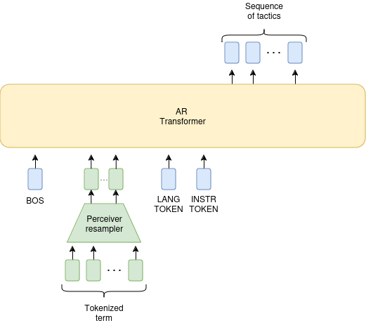

In this scenario, we train a transformer from scratch.

**Will probably not be implemented**.

### Training tasks

Inspired by [[4](#4)], we first consider the following objectives (next token prediction):
*In the following, a proof term is a pretty-printed proof term.*

* Proof term prediction: Given a tactic state, predict the entire proof term.
* Skip-proof: Given a partial proof term (with a masked subterm), predict the masked subterm. 
* Type prediction: Given a partial proof term, predict the type of the masked subterm.
* Theorem naming: Given the type of a theorem, predict its name. **mathcomp and mathlib only**

Additionally, we consider the following goals:

* **Constant elaboration**: Given a constant in a proof term, predict its type.
* **Augmented tactics prediction**: Given a proof term, predict a sequence of tactics and some intermediate goals.

A bit more precisely, we would like to train the model on the the following type of inputs:

| Objective                    | Input                                                                                                  |
|------------------------------|--------------------------------------------------------------------------------------------------------|
| Proof term prediction        | BOS \<SeqTactics\> LANGUAGE_TOKEN (\<Term\>)                                                           |
| Skip-proof                   | BOS \<Masked Term\> LANGUAGE_TOKEN SKIP_PROOF (\<Term\>)                                               |
| Type prediction              | BOS \<Masked Term\> LANGUAGE_TOKEN TYPE_PRED (\<Subterm type\>)                                        |
| Theorem naming               | BOS LANGUAGE_TOKEN NAME_PRED \<Theorem type\> (\<Theorem name\>)                                       |
| Constant elaboration         | BOS \<Term\> LANGUAGE_TOKEN \<Constant name\> TYPE_PRED (\<Constant type\>)                            |
| Augmented tactics prediction | BOS \<Term\> LANGUAGE_TOKEN \<goals_input\> (Tactic_1) GOAL_PREDICT (\<goals_output\>) (Tactic_1) etc. |

### Architecture

Our base archiecture is a **decoder-only transformer** [[13](#13)] as in prior works[[4](#4), [9](#9)].
To address the issue of excessively long $\lambda$-term, and inspired by the multimodal literature in the settings of interleaved vision and language tokens [[16](#16), [17](#17), [18](#18)], we use a **perceiver resampler encoder** [[15](#15)] to compress the $\lambda$-term into a shorter sequences of tokens.

The final models would corresponds to [Fig.2.](#architecture)

||
|:--:|
|**Fig. 2.** Architecture of the model|

## Bibliography

[<a id="1">1</a>]
Taro Sekiyama,
Akifumi Imanishi,
Kohei Suenaga:
Towards Proof Synthesis  Guided by Neural Machine Translation  for Intuitionistic Propositional Logic.

[<a id="2">2</a>]
Brando Miranda,
Nathan Fulton,
Avi Shinnar,
Vasily Pestun,
Barry Trager:
Transformer Models for Type Inference in the  Simply Typed Lambda Calculus: A Case Study  in Deep Learning for Code

[<a id="3">3</a>]
Hanzhuo Tan,
Qi Luo,
Jing Li,
Yuqun Zhang:
LLM4Decompile: Decompiling Binary Code with Large Language Models

[<a id="4">4</a>]
Jesse Michael Han,
Jason Rute,
Edward W. Ayers,
Stanislas Polu:
Proof Artifact Co-training for Theorem Proving with Language Models

[<a id="5">5</a>]
Kyle Thompson,
Nuno Saavedra,
Pedro Carrott,
Kevin Fisher,
Alex Sanchez-Stern,
Yuriy Brun,
Joao F. Ferreira
Sorin Lerner
Emily First:
Rango: Adaptive Retrieval-Augmented Proving for  Automated Software Verification

[<a id="6">6</a>]
Kaiyu Yang,
Aidan M. Swope,
Alex Gu,
Rahul Chalamala,
Peiyang Song,
Shixing Yu,
Saad Godil,
Ryan Prenger,
Anima Anandkumar:
LeanDojo: Theorem Proving with Retrieval-Augmented Language Models

[<a id="7">7</a>]
Kunhao Zheng,
Jesse Michael Han,
Stanislas Polu:
miniF2F: A Cross-system Benchmark for Formal Olympiad-level Mathematics

[<a id="9">9</a>]
Huajian Xin,
Z.Z. Ren,
Junxiao Song,
Zhihong Shao,
Wanjia Zhao,
Haocheng Wang,
Bo Liu,
Liyue Zhang Xuan Lu,
Qiushi Du,
Wenjun Gao,
Qihao Zhu,
Dejian Yang,
Zhibin Gou,
Z.F. Wu,
Fuli Luo,
Chong Ruan:
DeepSeek-Prover-V1.5: Harnessing Proof Assistant Feedback for Reinforcement Learning and Monte-Carlo Tree Search

[<a id="10">10</a>]
Huajian Xin,
Daya Guo,
Zhihong Shao,
Z.Z. Ren,
Qihao Zhu,
Bo Liu,
Chong Ruan,
Wenda Li,
Xiaodan Liang:
DeepSeek-Prover: Advancing Theorem Proving in LLMs through Large-Scale Synthetic Data

[<a id="11">11</a>]
Daya Guo,
Qihao Zhu,
Dejian Yang,
Zhenda Xie,
Kai Dong,
Wentao Zhang,
Guanting Chen,
Xiao Bi,
Y. Wu,
Y.K. Li,
Fuli Luo,
Yingfei Xiong,
Wenfeng Liang:
DeepSeek-Coder: When the Large Language Model Meets Programming -- The Rise of Code Intelligence

[<a id="12">12</a>]
Pedro Carrott,
Nuno Saavedra,
Kyle Thompson,
Sorin Lerner,
João F. Ferreira,
Emily First:
CoqPyt: Proof Navigation in Python in the Era of LLMs

[<a id="13">13</a>]
Ashish Vaswani,
Noam Shazeer,
Niki Parmar,
Jakob Uszkoreit,
Llion Jones,
Aidan N. Gomez,
Lukasz Kaiser,
Illia Polosukhin:
Attention Is All You Need

[<a id="15">15</a>]
Andrew Jaegle,
Sebastian Borgeaud,
Jean-Baptiste Alayrac,
Carl Doersch,
Catalin Ionescu,
David Ding,
Skanda Koppula,
Daniel Zoran,
Andrew Brock,
Evan Shelhamer,
Olivier Hénaff,
Matthew M. Botvinick,
Andrew Zisserman,
Oriol Vinyals,
Joāo Carreira:
Perceiver IO: A General Architecture for Structured Inputs & Outputs

[<a id="16">16</a>]
Hugo Laurençon,
Léo Tronchon,
Matthieu Cord,
Victor Sanh:
What matters when building vision-language models? 

[<a id="17">17</a>]
Xiaoyi Dong,
Pan Zhang,
Yuhang Zang,
Yuhang Cao,
Bin Wang,
Linke Ouyang,
Xilin Wei,
Songyang Zhang,
Haodong Duan,
Maosong Cao,
Wenwei Zhang,
Yining Li,
Hang Yan,
Yang Gao,
Xinyue Zhang,
Wei Li,
Jingwen Li,
Kai Chen,
Conghui He,
Xingcheng Zhang,
Yu Qiao,
Dahua Lin,
Jiaqi Wang: Internlm-xcomposer2: Mastering free-form text-image composition and comprehension in vision-language large model. 

[<a id="18">18</a>]
Shakti N. Wadekar,
Abhishek Chaurasia,
Aman Chadha,
Eugenio Culurciello: The Evolution of Multimodal Model Architectures.

[<a id="19">19</a>]
S. Polu,
I. Sutskever:
Generative language modeling for automated theorem proving. 

[<a id="NC_1">20</a>]
Andrew Jaegle,
Felix Gimeno,
Andrew Brock,
Andrew Zisserman,
Oriol Vinyals,
Joao Carreira:
Perceiver: General Perception with Iterative Attention

[<a id="21">21</a>]
DeepSeek-AI, Daya Guo, Dejian Yang, Haowei Zhang, Junxiao Song, Ruoyu Zhang, Runxin Xu, Qihao Zhu, Shirong Ma, Peiyi Wang, Xiao Bi, Xiaokang Zhang, Xingkai Yu, Yu Wu, Z.F. Wu, Zhibin Gou, Zhihong Shao, Zhuoshu Li, Ziyi Gao, Aixin Liu, Bing Xue, Bingxuan Wang, Bochao Wu, Bei Feng, Chengda Lu, Chenggang Zhao, Chengqi Deng, Chenyu Zhang, Chong Ruan, Damai Dai, Deli Chen, Dongjie Ji, Erhang Li, Fangyun Lin, Fucong Dai, Fuli Luo, Guangbo Hao, Guanting Chen, Guowei Li, H. Zhang, Han Bao, Hanwei Xu, Haocheng Wang, Honghui Ding, Huajian Xin, Huazuo Gao, Hui Qu, Hui Li, Jianzhong Guo, Jiashi Li, Jiawei Wang, Jingchang Chen, Jingyang Yuan, Junjie Qiu, Junlong Li, J.L. Cai, Jiaqi Ni, Jian Liang, Jin Chen, Kai Dong, Kai Hu, Kaige Gao, Kang Guan, Kexin Huang, Kuai Yu, Lean Wang, Lecong Zhang, Liang Zhao, Litong Wang, Liyue Zhang, Lei Xu, Leyi Xia, Mingchuan Zhang, Minghua Zhang, Minghui Tang, Meng Li, Miaojun Wang, Mingming Li, Ning Tian, Panpan Huang, Peng Zhang, Qiancheng Wang, Qinyu Chen, Qiushi Du, Ruiqi Ge, Ruisong Zhang, Ruizhe Pan, Runji Wang, R.J. Chen, R.L. Jin, Ruyi Chen, Shanghao Lu, Shangyan Zhou, Shanhuang Chen, Shengfeng Ye, Shiyu Wang, Shuiping Yu, Shunfeng Zhou, Shuting Pan, S.S. Li et al:
DeepSeek-R1: Incentivizing Reasoning Capability in LLMs via Reinforcement Learning

[<a id="22">22</a>]
OpenAI: Aaron Jaech, Adam Kalai, Adam Lerer, Adam Richardson, Ahmed El-Kishky, Aiden Low, Alec Helyar, Aleksander Madry, Alex Beutel, Alex Carney, Alex Iftimie, Alex Karpenko, Alex Tachard Passos, Alexander Neitz, Alexander Prokofiev, Alexander Wei, Allison Tam, Ally Bennett, Ananya Kumar, Andre Saraiva, Andrea Vallone, Andrew Duberstein, Andrew Kondrich, Andrey Mishchenko, Andy Applebaum, Angela Jiang, Ashvin Nair, Barret Zoph, Behrooz Ghorbani, Ben Rossen, Benjamin Sokolowsky, Boaz Barak, Bob McGrew, Borys Minaiev, Botao Hao, Bowen Baker, Brandon Houghton, Brandon McKinzie, Brydon Eastman, Camillo Lugaresi, Cary Bassin, Cary Hudson, Chak Ming Li, Charles de Bourcy, Chelsea Voss, Chen Shen, Chong Zhang, Chris Koch, Chris Orsinger, Christopher Hesse, Claudia Fischer, Clive Chan, Dan Roberts, Daniel Kappler, Daniel Levy, Daniel Selsam, David Dohan, David Farhi, David Mely, David Robinson, Dimitris Tsipras, Doug Li, Dragos Oprica, Eben Freeman, Eddie Zhang, Edmund Wong, Elizabeth Proehl, Enoch Cheung, Eric Mitchell, Eric Wallace, Erik Ritter, Evan Mays, Fan Wang, Felipe Petroski Such, Filippo Raso, Florencia Leoni, Foivos Tsimpourlas, Francis Song, Fred von Lohmann, Freddie Sulit, Geoff Salmon, Giambattista Parascandolo, Gildas Chabot, Grace Zhao, Greg Brockman, Guillaume Leclerc, Hadi Salman, Haiming Bao, Hao Sheng, Hart Andrin, Hessam Bagherinezhad, Hongyu Ren, Hunter Lightman, Hyung Won Chung, Ian Kivlichan, Ian O'Connell, Ian Osband, Ignasi Clavera Gilaberte, Ilge Akkaya et al.:
OpenAI o1 System Card

[<a id="23">23</a>]
H. Lightman, V. Kosaraju, Y. Burda, H. Edwards, B. Baker, T. Lee, J. Leike, J. Schulman, I. Sutskever, and K. Cobbe:
Let’s verify step by step. 

[<a id="24">24</a>]
Zhenru Zhang, Chujie Zheng, Yangzhen Wu, Beichen Zhang, Runji Lin, Bowen Yu, Dayiheng Liu, Jingren Zhou, Junyang Lin:
The Lessons of Developing Process Reward Models in Mathematical Reasoning

[<a id="25">25</a>]
Peiyi Wang, Lei Li, Zhihong Shao, Runxin Xu, Damai Dai, Yifei Li, Deli Chen, Yu Wu, and Zhifang Sui.
Math-shepherd: Verify and reinforce LLMs step-by-step without human annotations

[<a id="26">26</a>]
Liangchen Luo, Yinxiao Liu, Rosanne Liu, Samrat Phatale, Meiqi Guo, Harsh Lara, Yunxuan Li, Lei Shu,
Yun Zhu, Lei Meng, Jiao Sun, and Abhinav Rastogi: Improve mathematical reasoning in language
models by automated process supervision

[<a id="27">27</a>]
Niklas Muennighoff, Zitong Yang, Weijia Shi, Xiang Lisa Li, Li Fei-Fei, Hannaneh Hajishirzi, Luke Zettlemoyer, Percy Liang, Emmanuel Candès, Tatsunori Hashimoto: s1: Simple test-time scaling

[<a id="28">28</a>]
Laetitia Teodorescu,
Guillaume Baudart,
Emilio Jesús Gallego Arias,
Marc Lelarge,
NLIR: Natural Language Intermediate Representation for Mechanized Theorem Proving

[<a id="29">29</a>]
Jules Viennot,
Guillaume Baudart,
Emilio Jesús Gallego Arias,
Marc Lelarge:
MiniF2F in Rocq: Automatic Translation Between Proof Assistants — A Case Study

